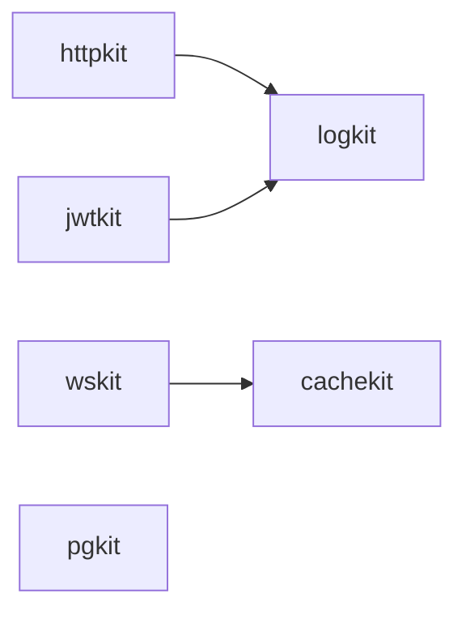

# go-kit

Opinionated Go toolkit — a collection of focused libraries for building production-ready backends.

Each kit is an independent module with its own versioning, CI, and minimal dependency surface.

## Kits

| Kit | Description | Version |
|-----|-------------|---------|
| [go-logkit](https://github.com/wahrwelt-kit/go-logkit) | Structured logging (zerolog) | [](https://pkg.go.dev/github.com/wahrwelt-kit/go-logkit) |
| [go-httpkit](https://github.com/wahrwelt-kit/go-httpkit) | HTTP middleware, error handling, health checks (chi-first) | [](https://pkg.go.dev/github.com/wahrwelt-kit/go-httpkit) |
| [go-pgkit](https://github.com/wahrwelt-kit/go-pgkit) | PostgreSQL pool, migrations, error helpers (pgx) | [](https://pkg.go.dev/github.com/wahrwelt-kit/go-pgkit) |
| [go-jwtkit](https://github.com/wahrwelt-kit/go-jwtkit) | JWT auth — symmetric & asymmetric, middleware, revocation | [](https://pkg.go.dev/github.com/wahrwelt-kit/go-jwtkit) |
| [go-cachekit](https://github.com/wahrwelt-kit/go-cachekit) | Redis cache with singleflight, KV store, Pub/Sub | [](https://pkg.go.dev/github.com/wahrwelt-kit/go-cachekit) |
| [go-wskit](https://github.com/wahrwelt-kit/go-wskit) | WebSocket hub with Redis Pub/Sub scaling (coder/websocket) | [](https://pkg.go.dev/github.com/wahrwelt-kit/go-wskit) |

## Dependency Graph



## Quick Start

```bash
go get github.com/wahrwelt-kit/go-logkit@latest
go get github.com/wahrwelt-kit/go-httpkit@latest
go get github.com/wahrwelt-kit/go-pgkit@latest
go get github.com/wahrwelt-kit/go-jwtkit@latest
go get github.com/wahrwelt-kit/go-cachekit@latest
go get github.com/wahrwelt-kit/go-wskit@latest
```

Minimal chi server with logging, JWT auth, PostgreSQL and Redis cache:

```go
r := chi.NewRouter()
r.Use(middleware.RequestID())
r.Use(middleware.Logger(log, nil))
r.Use(middleware.Recoverer(log))

r.Get("/health", httputil.HealthHandler(nil))

r.Group(func(r chi.Router) {
    r.Use(jwtkit.JWTAuth(jwtSvc, jwtkit.WithLogger(log)))
    r.Get("/users/{id}", getUserHandler(pool, cache))
})
```

Full working examples in [`examples/`](examples/).

## Examples

| Example | Router | Kits used |
|---------|--------|-----------|
| [chi-rest](examples/chi-rest) | chi | logkit, httpkit, pgkit, jwtkit, cachekit |
| [chi-realtime](examples/chi-realtime) | chi | logkit, httpkit, wskit, cachekit |
| [gin-rest](examples/gin-rest) | gin | logkit, pgkit, jwtkit, cachekit |
| [gin-realtime](examples/gin-realtime) | gin | logkit, wskit, cachekit |

## Benchmarks

Aggregated benchmark results from all kits are available in [`benchmarks/`](benchmarks/).

Run locally:

```bash
./benchmarks/run.sh
```

## Design Principles

- **Independent modules** — each kit has its own `go.mod`, semver, and CI pipeline
- **Functional options** — consistent configuration pattern across all kits
- **Consumer-side interfaces** — interfaces defined where they are used, not where implemented
- **Zero framework lock-in** — middleware works with `http.Handler`; chi is preferred, not required
- **Minimal dependencies** — each kit pulls only what it needs
